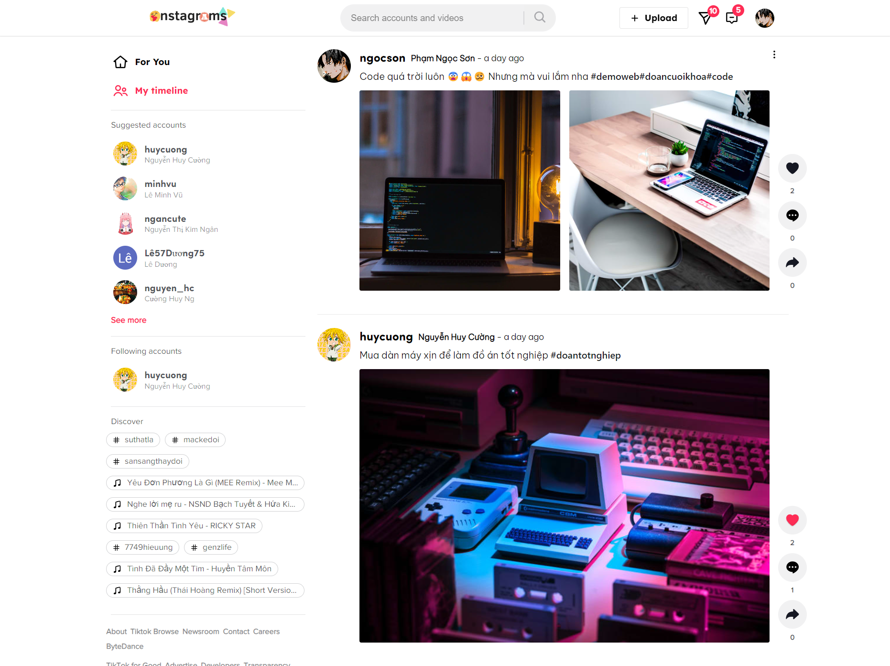

# :star2:ONSTAGRAMS:star2:


## :bookmark:Table of Contents
* [Technologies And Packages Used](#technologies-and-packages-used)
* [Features](#features)
* [Screenshots](#screenshots)
* [Setup](#setup)
* [Contact](#contact)


## :mag_right:Technologies And Packages Used
**Server:** 
- NodeJS
- ExpressJS
- Mongoose
- JWT
- Cloudinary
- Nodemon
- Nodemailer
- Bcrypt
- Multer
- Google Auth Library
- PassportJS
- Passport-JWT
- Bootstrap
- Nanoid

**Client:** 
- ReactJS
- Redux
- Axios
- Framer-Motion


## :pencil:Features
List the ready features here:
- Register
- <del> Login With Onstagram Or Login With Google </del> (maintance)
- Forgot Password/Reset Password
- Verify Email
- Edit Your Profile
- Upload Post With Single Image Or Multi Image
- Edit Post
- Delete Post Or Delete Only One Image On Multi Image Post
- Follow/Unfollow Another Users
- Like/Dislike Post Another Users
- Comment Post Another Users
- Get Timeline In Homepage If You Following That User


## :camera:Screenshots



## :wrench:Setup

- When clone my project to your computer, open it with VSCODE
- Install locally using npm, open Terminal in VSCODE:

```
install package for server: $ npm install
install package for client: $ npm run client-install

```

- When after success install package for client and server, to run this project:
```
only run server: $ npm run server
only run client: $ npm run client
run server and client: $ npm run dev
```

## :e-mail:Contact:
- Backend: Phạm Ngọc Sơn
- Frontend: Nguyễn Huy Cường
